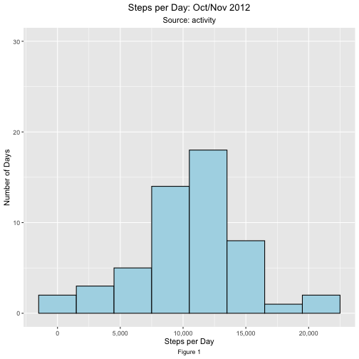
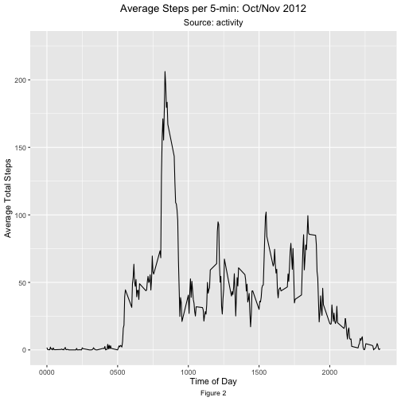
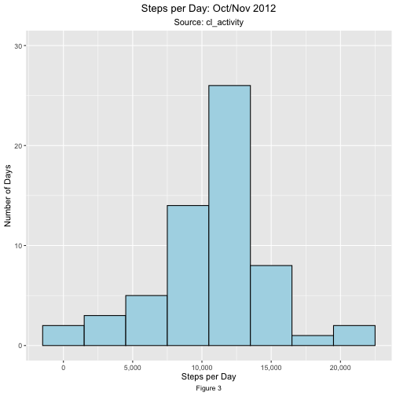
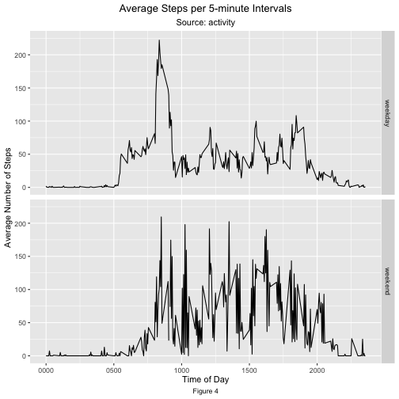

##### Submitted by Lisa Murray for the JHU Reproducible Research course

## Overview

Personal wearable activity monitoring devices are extremely popular. The summary data are used to track daily activity for the end user. This project delves further into the raw data stored by these devices to attempt to find more granular activity patterns that can be interpreted.

The data for this project were collected from an anonymous individual over the months of October and November 2012. The number of steps were collect at 5 minute intervals throughout the day.

This document outlines the steps that were taken to load and analyze the data to answer the specific questions below.

## Loading and Pre-Processing the Data

Before the data are read into the working environment, ensure that the following packages are loaded into the working directory:


```r
library(ggplot2)
library(dplyr)   
library(knitr)
library(rmarkdown)
library(scales)
```

### Loading the Data

The data are stored in a comma-separated-value (CSV) file, which has been archived/compressed into a zipped file. After ensuring that the raw data file **activity.zip** resides in the working directory, uncompress the file (with the **unz()** function).

- Load the raw data into the work environment using the **read.csv()** function with header = TRUE. The output dataset is called **activityRAW**.


```r
activityRAW <- read.csv(unz("activity.zip", "activity.csv"), header = TRUE)
```

Once the data are loaded, create a copy (**activity**) of the raw file to ensure the integrity of the raw data so it can be referred to, unchanged, during the process if needed.


```r
activity <- activityRAW
```

### Pre-processing the Data

After the **activity** dataset is created, examine it to confirm the characteristics of the data match dataset information provided in the assignment.

- Use the **head()** and **tail()** functions to get a first look at the beginning and end records of the dataset


```r
head(activity)
```

```
##   steps       date interval
## 1    NA 2012-10-01        0
## 2    NA 2012-10-01        5
## 3    NA 2012-10-01       10
## 4    NA 2012-10-01       15
## 5    NA 2012-10-01       20
## 6    NA 2012-10-01       25
```

```r
tail(activity)
```

```
##       steps       date interval
## 17563    NA 2012-11-30     2330
## 17564    NA 2012-11-30     2335
## 17565    NA 2012-11-30     2340
## 17566    NA 2012-11-30     2345
## 17567    NA 2012-11-30     2350
## 17568    NA 2012-11-30     2355
```

-   Confirm there are a total of **17,568** observations in the file, by running the **dim()** function.


```r
dim(activity)
```

```
## [1] 17568     3
```

*The record count is correct.*

-   Use the **names()** and **str()** functions to confirm that the heading names and field formats match the information provided:

    a\. **steps**: Number of steps taking in a 5-minute interval (*missing values are coded as NA*)

    b\. **date**: The date on which the measurement was taken in *YYYY-MM-DD* format

    c\. **interval**: Identifier for the 5-minute interval in which measurement was taken


```r
names(activity)
```

```
## [1] "steps"    "date"     "interval"
```


```r
str(activity)
```

```
## 'data.frame':	17568 obs. of  3 variables:
##  $ steps   : int  NA NA NA NA NA NA NA NA NA NA ...
##  $ date    : chr  "2012-10-01" "2012-10-01" "2012-10-01" "2012-10-01" ...
##  $ interval: int  0 5 10 15 20 25 30 35 40 45 ...
```

*The field formats are as expected.* 

Note the following:

-   the **date** field is **not** in *date* format, which is the format needed to perform any date-related analysis
-   the **interval** field represents 5-minute intervals in 24-hour format

Pre-process the **date** field to modify format. There is no need to modify the **interval** field at this time.

- Use the **as.Date.factor()** function to convert the format of the **date** field.


```r
activity$date <- as.Date.factor(activity$date)
```

- Confirm the conversion worked with the **str()** function.


```r
str(activity)
```

```
## 'data.frame':	17568 obs. of  3 variables:
##  $ steps   : int  NA NA NA NA NA NA NA NA NA NA ...
##  $ date    : Date, format:  ...
##  $ interval: int  0 5 10 15 20 25 30 35 40 45 ...
```

Now the date field is modified, get an overview of the data that are in the dataset.

- Use the **summary()** function.


```r
summary(activity)
```

```
##      steps       
##  Min.   :  0.00  
##  1st Qu.:  0.00  
##  Median :  0.00  
##  Mean   : 37.38  
##  3rd Qu.: 12.00  
##  Max.   :806.00  
##  NA's   :2304    
##       date           
##  Min.   :2012-10-01  
##  1st Qu.:2012-10-16  
##  Median :2012-10-31  
##  Mean   :2012-10-31  
##  3rd Qu.:2012-11-15  
##  Max.   :2012-11-30  
##                      
##     interval     
##  Min.   :   0.0  
##  1st Qu.: 588.8  
##  Median :1177.5  
##  Mean   :1177.5  
##  3rd Qu.:1766.2  
##  Max.   :2355.0  
## 
```

NOTE: There are 2304 missing **steps** values (NA) dataset. *This will be addressed later in the analysis*

There does not appear to be anything else that needs to be pre-processed at this time.

## Data Analysis

First, analyze the **activity** file to answer the following question.

### What is the mean total number of steps taken per day?

To determine the mean total steps per day, perform the following steps:

#### Determine the number of steps taken per day

- Sum the total number of steps per day using **aggregate()** function. Create a new dataset  **actStepsPD**.  


```r
# sum the number of steps per day
actStepsPD <- aggregate(steps ~ date, activity, sum)

# display a few records of the new dataset
head (actStepsPD)
```

```
##         date steps
## 1 2012-10-02   126
## 2 2012-10-03 11352
## 3 2012-10-04 12116
## 4 2012-10-05 13294
## 5 2012-10-06 15420
## 6 2012-10-07 11015
```

#### Create a histogram of the total number of steps taken each day

- Use the **ggplot()** function to create a histogram with the following code. In order to compare results using different versions of the data, create a *ylim* range to use in all subsequent. Since the data are by month, use a 0 to 30 limit.


```r
ggplot(actStepsPD, aes(x = steps)) +
        geom_histogram(color = "black", fill = "lightblue", binwidth = 3000) +
        scale_x_continuous("Steps per Day", label = comma) +
# set a y-axis limit for all histograms
        ylim(0, 30) +
        labs(title = "Steps per Day: Oct/Nov 2012",
             subtitle = "Source: activity",
             y = "Number of Days",
             caption = "Figure 1",) +
        theme(plot.title = element_text(hjust=0.5),
              plot.subtitle = element_text(hjust=0.5),
              plot.caption = element_text(hjust=0.5))
```



#### Calculate the mean of the total number of steps taken per day

- Use the **mean()** function to calculate the mean number of steps and save it as **actMean** so it can be referred to in later analysis as needed.


```r
actMean <- mean(actStepsPD$steps)

# display variable
actMean
```

```
## [1] 10766.19
```

#### Calculate the median of the total number of steps taken per day.

- Use the **median()** function to calculate the median number of steps and save it as **actMedian**.


```r
actMedian <- median(actStepsPD$steps)

# display variable
actMedian
```

```
## [1] 10765
```

### What is the average daily activity pattern?

#### Create a time series plot of the 5-minute interval (x-axis) and the average number of steps taken, averaged across all days (y-axis)

- Aggregate the data by 5-minute time interval into a file called **actMeanPerInt**.


```r
actMeanPerInt <-
    aggregate(steps ~ interval, activity, mean)

# display records of file
head(actMeanPerInt)
```

```
##   interval     steps
## 1        0 1.7169811
## 2        5 0.3396226
## 3       10 0.1320755
## 4       15 0.1509434
## 5       20 0.0754717
## 6       25 2.0943396
```

- Create a time series plot using the **actMeanPerInt** dataset.

*Note: since the time in the file is in a 24-hour format, we pad the times before 1000 in the plot with leading zeroes for better ease of reading.*


```r
ggplot(data = actMeanPerInt, aes(interval,steps)) +
  geom_line() +
        scale_x_continuous(labels = function(x)
# pad the time with leading zeroes for ease of reading
               stringr::str_pad(x, width = 4, pad = "0")) +
# set a y-axis limit for all time series plots
        ylim(0, 225) +
        labs(title = "Average Steps per 5-min: Oct/Nov 2012",
                subtitle = "Source: activity",
                x = "Time of Day",
                y ="Average Total Steps",
                caption = "Figure 2") +
        theme(plot.title = element_text(hjust=0.5),
              plot.subtitle = element_text(hjust=0.5),
              plot.caption = element_text(hjust=0.5))
```



#### Determine which 5 minute interval, on average across all the days in the dataset, contains the maximum number of steps.

- Find the maximum step count in the **actMeanPerInt** dataset. Use this value to find the record that has the max step count to determine the time at which it occurred.ded.


```r
# find the max step value
actMaxPerInt <- max(actMeanPerInt$steps)
actMaxPerInt
```

```
## [1] 206.1698
```

```r
# find the record that has the max number of steps
actMax5Min <- subset(actMeanPerInt, steps == actMaxPerInt)
actMax5Min
```

```
##     interval    steps
## 104      835 206.1698
```

```r
# pad the time with leading zeroes for ease of reading
actMax5MinTime <- stringr::str_pad(actMax5Min$interval, width = 4, pad = "0")
actMax5Min
```

```
##     interval    steps
## 104      835 206.1698
```

Results:
The maximum steps taken at any time (**actMaxPerInt**) is 206.1698113.

The 5-minute interval (**actMax5MinTime**) at which these are is 0835.

### Imputing missing values

#### Confirm the number of missing values in the dataset.

As seen above, the **summary()** of **activity** showed that there are 2304 instances of NA, or missing values, in the **steps** field.

- Verify the number of NA values in the **steps** field


```r
actNAcount <- sum(is.na(activity$steps))

#display output
actNAcount
```

```
## [1] 2304
```

The number of missing values in the **steps** field is confirmed to be  2304.

#### Devise a strategy for filling in all of the missing values in the dataset

For each missing value, replace it with the calculated mean number of steps for that time interval.

####  Create a new dataset equal to the original dataset but with the missing data filled in

- View records of **activity** file for a "before" view.


```r
head(activity)
```

```
##   steps       date interval
## 1    NA 2012-10-01        0
## 2    NA 2012-10-01        5
## 3    NA 2012-10-01       10
## 4    NA 2012-10-01       15
## 5    NA 2012-10-01       20
## 6    NA 2012-10-01       25
```

Use the **actMeanPerInt** file as a reference to get a value if **steps** is missing in the **activity** file.

- First, use the **left_join()** function to join the files by the **interval** field.

- Then, use the **mutate()** function to modify the **step** value, if and only if it the field is missing data.

 - Create a new output file **cl_activity**, using **cl_** to identify it as being "clean", i.e. having no missing data.


```r
# create "clean" file by replacing empty step values with the calculated mean
cl_activity <- left_join(activity, actMeanPerInt,
                      by = 'interval') %>%
    mutate(steps = ifelse(is.na(steps.x),
                             steps.y, steps.x)) %>%
    select(-steps.y, -steps.x)
```

- View the output files


```r
head(cl_activity)
```

```
##         date interval     steps
## 1 2012-10-01        0 1.7169811
## 2 2012-10-01        5 0.3396226
## 3 2012-10-01       10 0.1320755
## 4 2012-10-01       15 0.1509434
## 5 2012-10-01       20 0.0754717
## 6 2012-10-01       25 2.0943396
```

- Run the **sum()** function to confirm there are no NA values in the files.


```r
cl_actNAcount <- sum(is.na(cl_activity$steps))

cl_actNAcount
```

```
## [1] 0
```

We confirm that there are 0 empty records in the **steps** field of the new file.

#### Create a histogram of the total number of steps taken each day

Use the same process documented for the **activity** dataset.

##### Determine the number of steps taken per day

- Sum the total number of steps per day using **aggregate()** function. Create a new dataset  **actStepsPD**.  


```r
# sum the number of steps per day

cl_actStepsPD <- aggregate(steps ~ date, cl_activity, sum)

# display a few records of the new dataset
head (cl_actStepsPD)
```

```
##         date    steps
## 1 2012-10-01 10766.19
## 2 2012-10-02   126.00
## 3 2012-10-03 11352.00
## 4 2012-10-04 12116.00
## 5 2012-10-05 13294.00
## 6 2012-10-06 15420.00
```
##### Create the histogram

- Use the **ggplot()** function to create a histogram with the following code. In order to compare results using different versions of the data, create a *ylim* range to use in all subsequent. Since the data are by month, use a 0 to 30 limit.


```r
ggplot(cl_actStepsPD, aes(x = steps)) +
        geom_histogram(color = "black", fill = "lightblue", binwidth = 3000) +
        scale_x_continuous("Steps per Day", label = comma) +
# set a y-axis limit for all similar histograms
        ylim(0, 30) +
        labs(title = "Steps per Day: Oct/Nov 2012",
             subtitle = "Source: cl_activity",
             y = "Number of Days",
             caption = "Figure 3",) +
        theme(plot.title = element_text(hjust=0.5),
              plot.subtitle = element_text(hjust=0.5),
              plot.caption = element_text(hjust=0.5))
```



##### Calculate the mean of the total number of steps taken per day

- Use the **mean()** function to calculate the mean number of steps and save it as **cl_actMean** so it can be referred to in later analysis as needed.


```r
cl_actMean <- mean(cl_actStepsPD$steps)

# display variable
cl_actMean
```

```
## [1] 10766.19
```

#### Calculate the median of the total number of steps taken per day.

- Use the **median()** function to calculate the median number of steps and save it as **cl_actMedian** so it can be referred to in later analysis as needed.


```r
cl_actMedian <- median(cl_actStepsPD$steps)

# display variable
cl_actMedian
```

```
## [1] 10766.19
```

#### Do these values different from the estimates from the first part of the assignment? What is the impact of imputing missing data on the estimates of the total daily number of steps?

- Comparing the histograms created from both the **activity** and **actClean** files, there is not a significant difference in the overall distribution/shape of the data, but, by adding the average number of steps per interval to the data increased the value of the number of days which the user walked the maximum number of steps.

- Comparing the mean values of **activity** and **cl_activity:


```r
diffMean <- abs(actMean - cl_actMean)

# display variable
diffMean
```

```
## [1] 0
```

The difference is 0 -- the mean has not changed.

- Comparing the median values of **activity** and **cl_activity:


```r
diffMedian <- abs(actMedian - cl_actMedian)

# display variable
diffMedian
```

```
## [1] 1.188679
```

The difference is 1.1886792 -- which is not significant.

Therefore, the difference made in the results when replacing the NA values was not significant. Thus, a more robust methodology for replacing the missing data is required.

### Are there differences in activity patterns between weekdays and weekends?

Since it has been determined above that there are no significant difference in the output after replacing the NA values, use the **activity** file for following analysis, since it more closely matches the raw data.

#### Create a new factor variable in the dataset

- Create a new column in the dataset, **day_type**, of type *factor*, with two levels - "weekday" and "weekend".

- Use the **weekdays()** function to determine the day of the week. If the day is "Saturday" or "Sunday", assign the value of "weekend", else assign "weekday".


```r
# create dow_type and populate
activity$day_type <- ifelse(
        weekdays(activity$date) == c("Saturday", "Sunday"),
        "weekend", "weekday")

# display sample of output
head(activity)
```

```
##   steps       date interval day_type
## 1    NA 2012-10-01        0  weekday
## 2    NA 2012-10-01        5  weekday
## 3    NA 2012-10-01       10  weekday
## 4    NA 2012-10-01       15  weekday
## 5    NA 2012-10-01       20  weekday
## 6    NA 2012-10-01       25  weekday
```

#### Make a panel plot containing a time series plot of the 5-minute interval (x-axis) and the average number of steps taken, averaged across all weekday days or weekend days (y-axis).

-   Aggregate the steps data by interval and day_type to create a new file **actMeanDayType**.


```r
# aggregate mean by interval and day_time
actMeanDayType <-
        aggregate(steps ~ interval + day_type,
                  activity, mean)

# display sample of output
head(actMeanDayType)
```

```
##   interval day_type      steps
## 1        0  weekday 1.97826087
## 2        5  weekday 0.39130435
## 3       10  weekday 0.15217391
## 4       15  weekday 0.17391304
## 5       20  weekday 0.08695652
## 6       25  weekday 1.28260870
```

- Using the **actMeanDayType** file, create a panel plot to compare the weekend and weekday data.


```r
ggplot(data = actMeanDayType, aes(x=interval, y= steps)) +
        facet_grid(day_type ~ .) +
        geom_line() +
        scale_x_continuous(labels = function(x)
# pad the time with leading zeroes for ease of reading
                stringr::str_pad(x, width = 4, pad = "0")) +
        ylim(0, 225) +
        labs(title = "Average Steps per 5-minute Intervals",
             subtitle = "Source: activity",
             x = "Time of Day",
             y ="Average Number of Steps",
             caption = "Figure 4") +
        theme(plot.title = element_text(hjust=0.5),
              plot.subtitle = element_text(hjust=0.5),
              plot.caption = element_text(hjust=0.5))
```



Comparing the weekday and weekend data, it appears that the subject's near zero movement patterns tend to be similar throughout each day, which indicates that the subject gets up and goes to bed at relatively the same time each day. However, there is a significant increase in steps during the weekend, indicating that the subject is much more sedentary during the week. 
