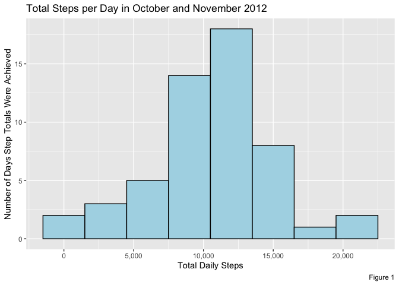
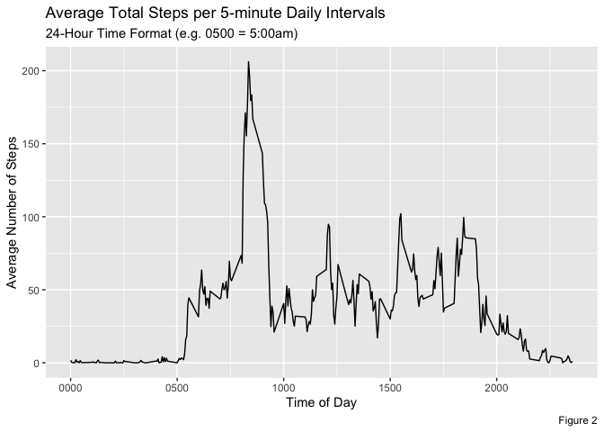
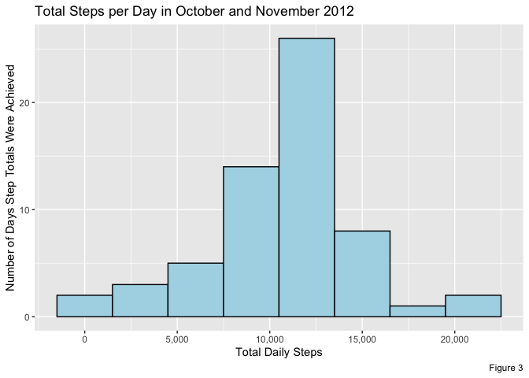
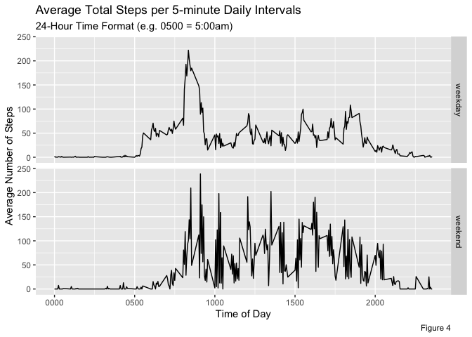
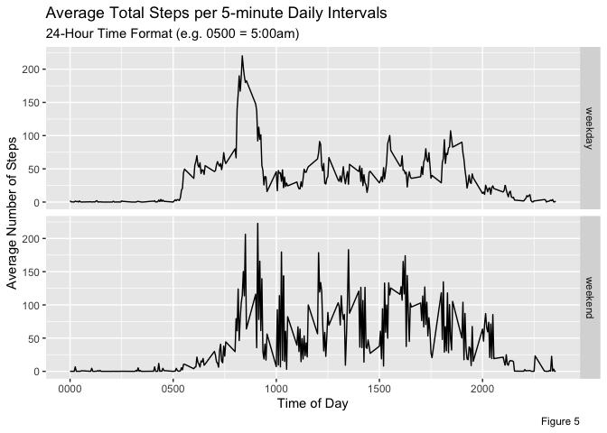

##### Submitted by Lisa Murray for the JHU Reproducible Research course

## Overview

Personal wearable activity monitoring devices are extremely popular. The summary data are used to track daily activity for the end user. This project delves further into the raw data stored by these devices to attempt to find more granular activity patterns that can be interpreted.

The data for this project were collected from an anonymous individual over the months of October and November 2012. The number of steps were collect at 5 minute intervals throughout the day.

This document outlines the steps that were taken to load and analyze the data to answer the specific questions below.

## Loading and Pre-Processing the Data

Before the data are read into the working environment, we ensure that the following packages are loaded into the working directory:


```r
library(ggplot2)
library(dplyr)   
library(knitr)
library(rmarkdown)
library(scales)
```

### a) Loading the Data

The data are stored in a comma-separated-value file, which has been archived/compressed into a zipped file. After ensuring that the raw data file **activity.zip** resides in the working directory, we uncompress the file (with the **unz()** function).

We then load the raw data into the work environment using the **read.csv()** function with header = TRUE. We call the output file **activityRAW**.


```r
activityRAW <- read.csv(unz("activity.zip", "activity.csv"), header = TRUE)
```

Once the data are loaded, we create a copy of the raw file to ensure the integrity of the raw data so it can be referred to, unchanged, during the process if needed. We call this file **activity**.


```r
activity <- activityRAW
```

### b) Pre-processing the Data

After the **activity** dataset is created, we examine it to confirm the characteristics are the data are the same as the dataset information provided in the assignment.

-   To confirm there are a total of \*\*17,568 \*\*observations in the file, we run the **dim()** function to determine the number of rows of data.


```r
dim(activity)
```

```
## [1] 17568     3
```

-   Using the **names()** and **str()** functions we confirm the heading names and the format of each field, per the dataset information provided:

    a\. **steps**: Number of steps taking in a 5-minute interval (*missing values are coded as NA*)

    b\. **date**: The date on which the measurement was taken in *YYYY-MM-DD* format

    c\. **interval**: Identifier for the 5-minute interval in which measurement was taken


```r
names(activity)
```

```
## [1] "steps"    "date"     "interval"
```


```r
str(activity)
```

```
## 'data.frame':	17568 obs. of  3 variables:
##  $ steps   : int  NA NA NA NA NA NA NA NA NA NA ...
##  $ date    : chr  "2012-10-01" "2012-10-01" "2012-10-01" "2012-10-01" ...
##  $ interval: int  0 5 10 15 20 25 30 35 40 45 ...
```

Now that we have confirmed that the data characteristics match what was expected. We note the following:

-   the **date** field is not in a date format, which is the format needed to do our analysis.
-   the **interval** field represent 5-minute intervals in 24-hour format

We make note of the **interval** field for reporting purposes, but must convert the **date** field by using the **as.Date.factor()** function. To confirm the conversion worked, again use the **str()** function.


```r
activity$date <- as.Date.factor(activity$date)

str(activity)
```

```
## 'data.frame':	17568 obs. of  3 variables:
##  $ steps   : int  NA NA NA NA NA NA NA NA NA NA ...
##  $ date    : Date, format: "2012-10-01" "2012-10-01" ...
##  $ interval: int  0 5 10 15 20 25 30 35 40 45 ...
```

Now that the date field has been converted, we use the **summary()** function to get a cursory overview of values in the dataset.


```r
summary(activity)
```

```
##      steps             date               interval     
##  Min.   :  0.00   Min.   :2012-10-01   Min.   :   0.0  
##  1st Qu.:  0.00   1st Qu.:2012-10-16   1st Qu.: 588.8  
##  Median :  0.00   Median :2012-10-31   Median :1177.5  
##  Mean   : 37.38   Mean   :2012-10-31   Mean   :1177.5  
##  3rd Qu.: 12.00   3rd Qu.:2012-11-15   3rd Qu.:1766.2  
##  Max.   :806.00   Max.   :2012-11-30   Max.   :2355.0  
##  NA's   :2304
```

The number of missing values (NA) in the **steps** field is **2304**. *NOTE: For initial analysis the dataset will contain missing data*

## Data Analysis

### 1.0 What is the mean total number of steps taken per day?

To determine the mean total number of steps taken per day, we perform the following:

#### 1.1 Determine the number of steps taken per day

To calculate the total number of steps taken per day, we first aggregate the total number of steps per date into a file called **actStepsPD**.


```r
actStepsPD <- aggregate(steps ~ date, activity, sum)
```

We use the **head()** function to view a sample of the file.


```r
head(actStepsPD)
```

```
##         date steps
## 1 2012-10-02   126
## 2 2012-10-03 11352
## 3 2012-10-04 12116
## 4 2012-10-05 13294
## 5 2012-10-06 15420
## 6 2012-10-07 11015
```

#### 1.2 Create a histogram of the total number of steps taken each day


```r
ggplot(actStepsPD, aes(x = steps)) +
    geom_histogram(color = "black", fill = "lightblue",
                   binwidth = 3000) +
  scale_x_continuous("Total Daily Steps",label = comma) +
  labs(title = "Total Steps per Day in October and November 2012", 
       y = "Number of Days Step Totals Were Achieved",
       caption = "Figure 1")
```

<!-- -->

#### 1.3 Calculate the mean of the total number of steps taken per day

Using the **mean()** function we calculate the mean number of steps and save it as **actMean**.


```r
actMean <- mean(actStepsPD$steps)
```

The mean number of steps is 1.0766189\times 10^{4}.

#### 1.4 Calculate the median of the total number of steps taken per day.

Using the **median()** function we calculate the mean number of steps and save it as **actMedian**.


```r
actMedian <- median(actStepsPD$steps)
```

The median number of steps is 10765.

### 2.0 What is the average daily activity pattern?

#### 2.1 Create a time series plot of the 5-minute interval (x-axis) and the average number of steps taken, averaged across all days (y-axis)

First we must aggregate the data by each 5-minute time interval of each day into a file called **actMeanPerInt**. 


```r
actMeanPerInt <-
    aggregate(steps ~ interval, activity, mean)
```

Use the **head()** function to view a sample of the file.


```r
head(actMeanPerInt)
```

```
##   interval     steps
## 1        0 1.7169811
## 2        5 0.3396226
## 3       10 0.1320755
## 4       15 0.1509434
## 5       20 0.0754717
## 6       25 2.0943396
```

Using this new aggregated data file as input, we can then create a time series plot.

*Note: since the time in the file is in a 24-hour format, we pad the times before 1000 in the plot with leading zeroes for better ease of reading.*


```r
ggplot(data = actMeanPerInt,
       aes(interval,steps)) +
  geom_line() + 
        labs(title = "Average Total Steps per 5-minute Daily Intervals",
             subtitle = "24-Hour Time Format (e.g. 0500 = 5:00am)",
             x = "Time of Day",
             y ="Average Number of Steps",
             caption = "Figure 2") +
        scale_x_continuous(labels = function(x) 
                stringr::str_pad(x, width = 4, pad = "0"))
```

<!-- -->

#### 2.2 Determine which 5 minute interval, on average across all the days in the dataset, contains the maximum number of steps.

To calculate this value, we use the **max()** function to find the maximum step count in the **actMeanPerInt** file. Then we will use the **subset()** function using the maximum step count to determine the record that has the maximum value. For ease of reading, the time interval is padded with zeroes if needed.


```r
actMaxPerInt <- max(actMeanPerInt$steps)
# subset the meanStepsPerInt to find the interval that has the maximum steps 
actMax5MinInt <- subset(actMeanPerInt, steps == actMaxPerInt)
actMax5MinInt <- stringr::str_pad(actMax5MinInt$interval, width = 4, pad = "0")
```

The maximum steps taken at any time (**actMaxPerInt**) which is 206.1698113.

The 5-minute interval (**actMax5MinInt**) at which this is taken is 0835.

### 3.0 Imputing missing values

#### 3.1 Confirm the number of missing values in the dataset.

While pre-processing the data, we ran the **summary()** function and determined that there were 2304 instances of NA, or missing values, in the **steps** field in the raw data. We can verify this number by using the **sum()** function on the NA values in the **steps** field.


```r
actNAcount <- sum(is.na(activity$steps))
```

We confirm that there are 2304 empty records in the **steps** field.

#### 3.2 Devise a strategy for filling in all of the missing values in the dataset

We have calculated the mean steps per interval above and saved it into a file (**actMeanPerInt**). When the **steps** field in the raw data is empty for a specific time interval, we can substitute the field with the value for the same time interval in the **actMeanPerInt** file. 

If the **steps** field is not empty, it will not be modified. 

#### 3.3 Creating a new dataset equal to the original dataset but with the missing data filled in

Using the **activity**, which has been pre-processed to correct the dates, we will use the **actMeanPerInt** file as a reference to get a value if **steps** is missing. To do this in R, we will use the **left_join()** function, to join the files by the **interval** value in both files. 

Then, using the **mutate()** function, we will modify the **step** value if and only if it is empty. 

We create a new output file **cl_activity**, using **c_** to identify it as being "clean", i.e. having no missing data.


```r
cl_activity <- left_join(activity, actMeanPerInt,
                      by = 'interval') %>%
    mutate(steps = ifelse(is.na(steps.x),
                             steps.y, steps.x)) %>%
    select(-steps.y, -steps.x)
```

To confirm that the data has been modified, we run the **sum()** function to confirm there are no NA values in the files. 


```r
cl_actNAcount <- sum(is.na(cl_activity$steps))
```

We confirm that there are 0 empty records in the **steps** field.

We can also confirm the modifications by comparing the first few lines of both the **activity** and **cleanAct** files with the **head()** function. *NOTE: in the modified file the **steps** field is on the right*


```r
head(activity)
```

```
##   steps       date interval
## 1    NA 2012-10-01        0
## 2    NA 2012-10-01        5
## 3    NA 2012-10-01       10
## 4    NA 2012-10-01       15
## 5    NA 2012-10-01       20
## 6    NA 2012-10-01       25
```


```r
head(cl_activity)
```

```
##         date interval     steps
## 1 2012-10-01        0 1.7169811
## 2 2012-10-01        5 0.3396226
## 3 2012-10-01       10 0.1320755
## 4 2012-10-01       15 0.1509434
## 5 2012-10-01       20 0.0754717
## 6 2012-10-01       25 2.0943396
```

#### 3.4 Create a histogram of the total number of steps taken each day

We will use the same process documented above to create the histogram for the **cl_activity** data set.

##### 3.4a Determine the number of steps taken per day


```r
cl_actStepsPD <- aggregate(steps ~ date, cl_activity, sum)
```

We use the **head()** function to view a sample of the file.


```r
head(cl_actStepsPD)
```

```
##         date    steps
## 1 2012-10-01 10766.19
## 2 2012-10-02   126.00
## 3 2012-10-03 11352.00
## 4 2012-10-04 12116.00
## 5 2012-10-05 13294.00
## 6 2012-10-06 15420.00
```
##### 3.4b Create the histogram


```r
ggplot(cl_actStepsPD, aes(x = steps)) +
    geom_histogram(color = "black", fill = "lightblue",
                   binwidth = 3000) +
  scale_x_continuous("Total Daily Steps",label = comma) +
  labs(title = "Total Steps per Day in October and November 2012",
       y = "Number of Days Step Totals Were Achieved",
       caption = "Figure 3")
```

<!-- -->

#### 3.4c Calculate the mean of the total number of steps taken per day

Using the **mean()** function we calculate the mean number of steps and save it as **actCleanMean**.


```r
cl_actMean <- mean(cl_actStepsPD$steps)
```

The mean number of steps is 1.0766189\times 10^{4}.

#### 3.4d Calculate the median of the total number of steps taken per day.

Using the **median()** function we calculate the mean number of steps and save it as **actCleanMedian**.


```r
cl_actMedian <- median(cl_actStepsPD$steps)
```

The median number of steps is 1.0766189\times 10^{4}.

#### 3.4e Do these values different from the estimates from the first part of the assignment? What is the impact of imputing missing data on the estimates of the total daily number of steps?

Comparing the histograms created from both the **activity** and **actClean** files, there is not a significant difference in the overall distribution/shape of the data, but, by adding the average number of steps per interval to the data increased the value of the number of days which the user walked the maximum number of steps.

Comparing the mean values     **NEED TO ADD TEXT HERE**         

Therefore, it does not appear that the missing data impacted the analysis regarding the number of steps taken.

### 4.0 Are there differences in activity patterns between weekdays and weekends?

**USE BOTH FILES** the data with the NA value replaced (**activityNoNA**), analyze the data to identify which data was captured on a weekend versus a weekday.

#### 4.1 Results with **activity** files

##### 4.1a Create a new factor variable in the dataset

We create a new column of data, **day_type**, of type *factor*, with two levels - "weekday" and "weekend".

Using the **activity** file, we use the **weekdays()** function to determine the day of the week. If the day is "Saturday" or "Sunday", we assign the value of weekend to **day_type**, else it will be "weekday". 


```r
activity$day_type <- ifelse(
        weekdays(activity$date) == c("Saturday", "Sunday"),
        "weekend", "weekday")

head(activity, n = 10)
```

```
##    steps       date interval day_type
## 1     NA 2012-10-01        0  weekday
## 2     NA 2012-10-01        5  weekday
## 3     NA 2012-10-01       10  weekday
## 4     NA 2012-10-01       15  weekday
## 5     NA 2012-10-01       20  weekday
## 6     NA 2012-10-01       25  weekday
## 7     NA 2012-10-01       30  weekday
## 8     NA 2012-10-01       35  weekday
## 9     NA 2012-10-01       40  weekday
## 10    NA 2012-10-01       45  weekday
```

##### 4.1b Make a panel plot containing a time series plot of the 5-minute interval (x-axis) and the average number of steps taken, averaged across all weekday days or weekend days (y-axis).

- First aggregate the steps data by interval and dow_type. View a sample of the data.


```r
actMeanDayType <-
        aggregate(steps ~ interval + day_type,
                  activity, mean)

head(actMeanDayType, n = 10)
```

```
##    interval day_type      steps
## 1         0  weekday 1.97826087
## 2         5  weekday 0.39130435
## 3        10  weekday 0.15217391
## 4        15  weekday 0.17391304
## 5        20  weekday 0.08695652
## 6        25  weekday 1.28260870
## 7        30  weekday 0.60869565
## 8        35  weekday 1.00000000
## 9        40  weekday 0.00000000
## 10       45  weekday 1.69565217
```

Using the new **actMeanDayType** file, we will then create a panel plot to compare the weekend and weekday data.


```r
ggplot(data = actMeanDayType,
       aes(x=interval, y= steps)) +
        facet_grid(day_type ~ .) +
        geom_line() +
        labs(title = "Average Total Steps per 5-minute Daily Intervals",
             subtitle = "24-Hour Time Format (e.g. 0500 = 5:00am)", 
             x = "Time of Day",
             y ="Average Number of Steps",
             caption = "Figure 4") +
        scale_x_continuous(labels = function(x) 
                stringr::str_pad(x, width = 4, pad = "0"))
```

<!-- -->

From this we can see that the, while the subject of this study moves around during the same time windows during both the weekdays and the weekend, the subject has a much higher activity level during the weekend.

#### 4.2 Results with **cl_activity** file

##### 4.2a Create a new factor variable in the dataset

We create a new column of data, **day_type**, of type *factor*, with two levels - "weekday" and "weekend".

Using the **cl_activity** file, we use the **weekdays()** function to determine the day of the week. If the day is "Saturday" or "Sunday", we assign the value of weekend to **day_type**, else it will be "weekday". 


```r
cl_activity$day_type <- ifelse(
        weekdays(cl_activity$date) == c("Saturday", "Sunday"),
        "weekend", "weekday")

head(cl_activity, n = 10)
```

```
##          date interval     steps day_type
## 1  2012-10-01        0 1.7169811  weekday
## 2  2012-10-01        5 0.3396226  weekday
## 3  2012-10-01       10 0.1320755  weekday
## 4  2012-10-01       15 0.1509434  weekday
## 5  2012-10-01       20 0.0754717  weekday
## 6  2012-10-01       25 2.0943396  weekday
## 7  2012-10-01       30 0.5283019  weekday
## 8  2012-10-01       35 0.8679245  weekday
## 9  2012-10-01       40 0.0000000  weekday
## 10 2012-10-01       45 1.4716981  weekday
```

##### 4.2b Make a panel plot containing a time series plot of the 5-minute interval (x-axis) and the average number of steps taken, averaged across all weekday days or weekend days (y-axis).

- First aggregate the steps data by interval and dow_type. View a sample of the data.


```r
cl_actMeanDayType <-
        aggregate(steps ~ interval + day_type,
                  cl_activity, mean)

head(cl_actMeanDayType, n = 10)
```

```
##    interval day_type      steps
## 1         0  weekday 1.94375222
## 2         5  weekday 0.38447846
## 3        10  weekday 0.14951940
## 4        15  weekday 0.17087932
## 5        20  weekday 0.08543966
## 6        25  weekday 1.38981844
## 7        30  weekday 0.59807761
## 8        35  weekday 0.98255607
## 9        40  weekday 0.00000000
## 10       45  weekday 1.66607334
```

Using the new **cl_actMeanDayType** file, we will then create a panel plot to compare the weekend and weekday data.


```r
ggplot(data = cl_actMeanDayType,
       aes(x=interval, y= steps)) +
        facet_grid(day_type ~ .) +
        geom_line() +
        labs(title = "Average Total Steps per 5-minute Daily Intervals",
             subtitle = "24-Hour Time Format (e.g. 0500 = 5:00am)", 
             x = "Time of Day",
             y ="Average Number of Steps",
             caption = "Figure 5") +
        scale_x_continuous(labels = function(x) 
                stringr::str_pad(x, width = 4, pad = "0"))
```

<!-- -->

From this we can see that the, while the subject of this study moves around during the same time windows during both the weekdays and the weekend, the subject has a much higher activity level during the weekend.
